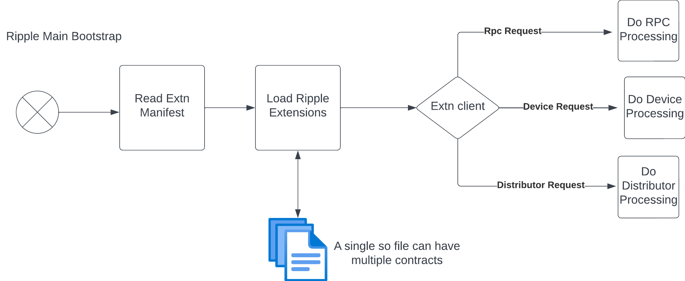

# Ripple 2.0
> let's ripple better

## How to run?

1. >$git submodule update --init --recursive
2. >$cargo build
3. Create a Plugin Manifest file here ~/.ripple/ripple_plugin_manifest.json
```
% 
{
    "default_path": "[Path to your workspace]/ripple-workspace/target/debug/",
    "default_extension": "dylib",
    "plugins": [
        {
            "path": "libthunder"
        },
        {
            "path": "librpc_extn"
        },
        {
            "path": "libthunder_extn"
        }
    ]
}
```
__*default_extension*__ value will be `dylib` for mac, `dll` for windows and for unix it will `so`
4. >cargo run core/main 

## Folder structure

Ripple folder structure has the below layers

#### Core folder
This folder contains the workspaces for 
1. `sdk` - Contains the building block for all ripple components. More info here.
2. `main` - Ripple main starter application loads the extensions, starts the gateway and its services.
3. `launcher`- Contains the Launcher code extension which uses Thunder RDKShell API for launching apps. Ripple can run without this extension for external launchers.

#### Examples folder
This folder contains the workspaces which solves usecase with actual examples
1. `rpc_extn` - Provides an example of how a firebolt method can be made into an extension using the sdk. This would be applicable for both Proprietary and Device specific extensions.
2. `thunder_extn` - Provides an example of how a Thunder method which might be Proprietary or bound to a device type be made into an extension.


### What is Ripple magic sauce?

Load extensions(Dynamic shared libraries) during Ripple Startup


Lets apply this to an actual Ripple 2.0 runtime which has loaded the below plugins
1. `device/thunder`: This starts the thunder thread and accepts Device Requests. It also accepts Device extentions which assist in proprietary thunder plugins and device specific thunder extensions.
2. `examples/rpc_extn`: This provides 2 extensions one for externalizing hdcp firebolt api and another to showcase support for legacy which can call into another rpc extension in `core/main`
3. `examples/thunder_extn`: Provides an extn for HDCPProfile Thunder api which exists in streaming devices and not on display devices like TV.


Breakdown the big Ripple monolith into smaller runtime extensions using a standardized SDK.


